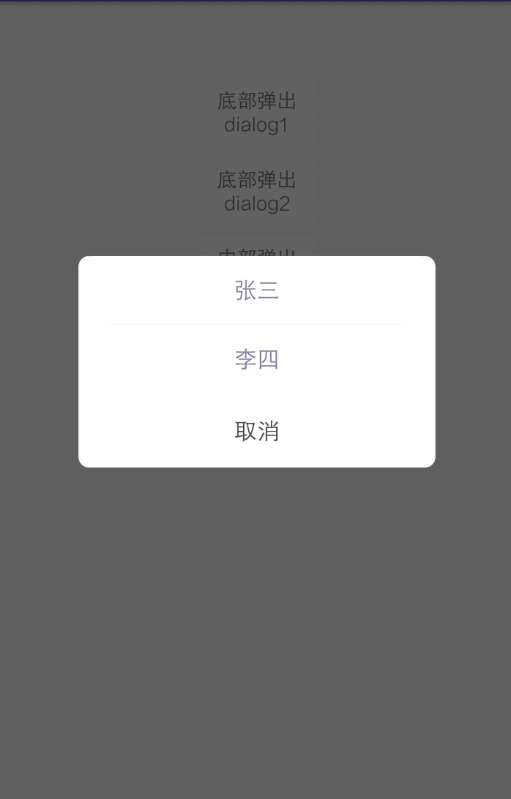

# CommonListDiaLogs
封装通用dialog  弹出框

由于每次写dialog都要写很多重复代码，因此简单的封装了一个CommonListDiaLogs,封装了一些常用方法，使用Builder模式实现:

### 展示效果：




### 使用方式：

Add the dependency to your build.gradle.

```java
dependencies {
    implementation 'com.github.Johnjson:CommonListDiaLogs:v1.0.1'
}
```


### 更新日志

**v1.0.1：**

```  public void showBottomListDialog1(@final Context context, String[] mList) {
        new BottomListDialog.Builder(context).
                addMenuListItem(mList, new OnClickPositionListener() {
                    @Override
                    public void onClickPosition(int position) {
                        Toast.makeText(context, "点击第几个位置    " + position, Toast.LENGTH_LONG).show();
                    }
                }).show();
    }
```

```public void showBottomListDialog2( final Context context, int color, int size) {
        new BottomListDialog.Builder(context).
                addMenuItem(new BottomListDialog.BottomListMenuItem("张三", new OnClickPositionListener() {
                    @Override
                    public void onClickPosition(int position) {
                        Toast.makeText(context, "点击第几个位置    " + position, Toast.LENGTH_LONG).show();
                    }
                },color,size)).
                addMenuItem(new BottomListDialog.BottomListMenuItem("李四", new OnClickPositionListener() {
                    @Override
                    public void onClickPosition(int position) {
                        Toast.makeText(context, "点击第几个位置    " + position, Toast.LENGTH_LONG).show();
                    }
                },color,size)).
                show();
    }
```


```   public void showMiddleListDialog1(final Context context, String[] mList) {
        new MiddleListDialog.Builder(context).
                addMenuListItem(mList, new OnClickPositionListener() {
                    @Override
                    public void onClickPosition(int position) {
                        Toast.makeText(context, "点击第几个位置    " + position, Toast.LENGTH_LONG).show();
                    }
                }).show();
    }
```

``` public void showMiddleListDialog2(final Context context, int color, int size) {
        new MiddleListDialog.Builder(context).
                addMenuItem(new MiddleListDialog. MiddleListMenuItem("张三", new OnClickPositionListener() {
                    @Override
                    public void onClickPosition(int position) {
                        Toast.makeText(context, "点击第几个位置    " + position, Toast.LENGTH_LONG).show();
                    }
                }, color, size)).
                addMenuItem(new MiddleListDialog. MiddleListMenuItem("李四", new OnClickPositionListener() {
                    @Override
                    public void onClickPosition(int position) {
                        Toast.makeText(context, "点击第几个位置    " + position, Toast.LENGTH_LONG).show();
                    }
                }, color, size)).
                show();
    }
```


```    @Override
    public void onClick(View v) {

        switch (v.getId()) {
            /**底部弹出1*/
            case R.id.mbottom1:
                String[] mList = MainActivity.this.getResources().getStringArray(R.array.selectList);
                showBottomListDialog1(MainActivity.this, mList);
                break;
            /**底部弹出2*/
            case R.id.mbottom2:
                showBottomListDialog2(MainActivity.this, R.dimen.com_font_size_16, getResources().getColor(R.color.colorAccent));
                break;

            /**中部弹出1*/
            case R.id.middle1:
                String[] mList1 = MainActivity.this.getResources().getStringArray(R.array.selectList);
                showMiddleListDialog1(MainActivity.this, mList1);
                break;
            /**中部弹出2*/
            case R.id.middle2:
                showMiddleListDialog2(MainActivity.this, R.dimen.com_font_size_16, getResources().getColor(R.color.colorAccent));
                break;
            default:
                break;
        }

    }```

如果你喜欢，欢迎stars